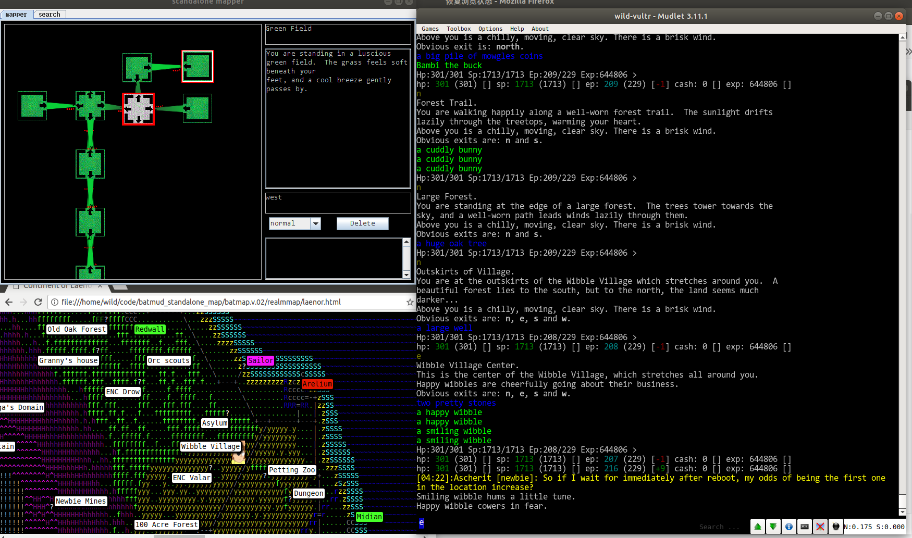

standalone map (big and small) for batmud. 

以原来 batmapper(https://github.com/lauriholmas/batmapper.git) 为基础，封装成室内地图；并实现web端的世界大地图；代理仍是采用符合bat proxy协议的bcproxy。

batmap.v.02目录开箱即用。

### 1 desc

based on maputils(http://pupunen.net/hg/maputils), batmapper(https://github.com/lauriholmas/batmapper.git) and bcproxy(https://github.com/zither/bcproxy-python.git) , building a standalone mapper/realmMap for common mud client to play batmud(http://www.bat.org/).

pls go into the directory 'batmap.v.02' and follow some directions.

not pretty code and structure exists now, and maybe i will Refactoring it later. i can using it to play now :D

== by wildfist ==
